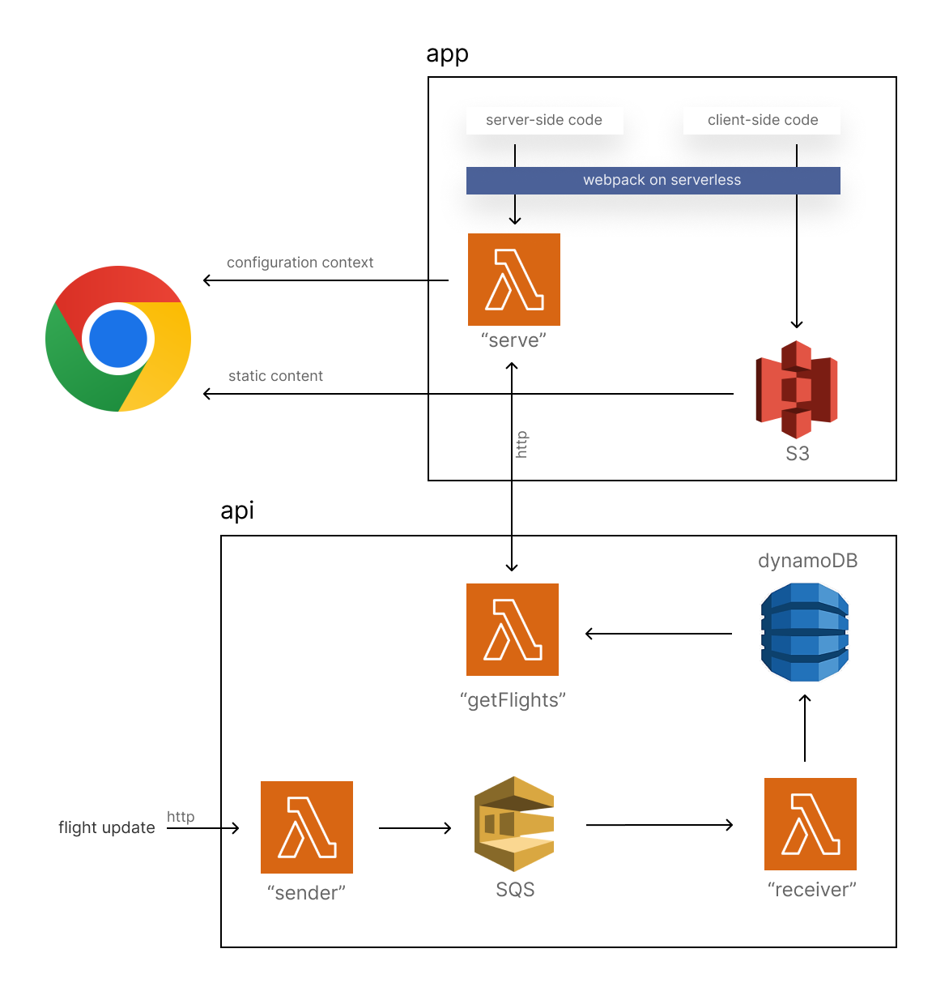

# Aero-psycho dashboard

An isomorphic React app with serverless architecture, alongside a serverless API, to showcase these technologies for an IoT use case.

You can try the application [here](https://9dlnegtote.execute-api.us-east-1.amazonaws.com/dev/), or watch a [video](https://www.loom.com/share/a09e37c9963a49b18fc872859001447c) of it. Click on the airport name to access other airports (TODO: clarify the UI so that there is no need to state this explicitly).

Although the API too is explained below, this repo contains only the app. Head over [here](https://github.com/mikael-wants-to-visit-disneyland/aero-psycho-api) to view the API's code.

## Hypothetical value proposition

Imagine a future where airlines' optimization of customer experience has reached the point that they have begun measuring various metrics inside flights using sensors. After weeks of hard work, a team of world-class service designers has narrowed the most critical metrics for the air travel experience to _mood_, _tiredness_ and _love_. Now we need a way to display these in an intuitive manner to our main user groups:

1. Airlines want to optimize their CX across their fleets.
2. Airports want to find out whether to take any mitigating measures after landing, depending on the CX on board.

This project is an MVP for the second user group. We aim to give airports the ability to monitor incoming flights, both on an aggregate and a granular level.

**Note**: This vision of biometric customer monitoring obviously has a disturbing taste; such a policy would constitute an egregious violation of privacy. Our aim here is not to suggest how air travel should develop, but rather to inspire you with the possibilities of cutting-edge technologies. And like all good pieces of dystopian fiction, hopefully this will strengthen your resolve to build up a future in which we would not have to experience such things.

## Architecture



### App

We use a universal aka. isomorphic React app, in which rendering is done server-side and a configuration context is passed into the browser. The server-side code is bundled and deployed as a lambda, which performs the rendering. The browser-side code is bundled for browsers, and then stored in S3 alongside static files. These files are then served to the client's browser, leveraging S3's and lambda's blazing-fast response times for a smooth, sweet UX.

We used [this](https://github.com/arabold/serverless-react-boilerplate) boilerplate for the isomorphic app. It is explained in depth [here](https://www.serverless.com/blog/react-js-on-aws-lambda).

### API

**Deployment**: The great variability of the intensity of air travel over a 24-cycle as well as over a year suggests that we should go for a serverless solution for the API too.

**Message handling**: We also have to be able to deal with a massive volume of flight updates, ensuring that their order is not messed up, and that nothing is lost. We have gone for AWS Simple Queue Service to manage our queue of flight updates. In other words, our API constitutes a webhook.

**Storage**: For the same reason, since we need a database solution of massive scalability and robustness, dynamoDB is our choice.

In summary, all flight updates are sent by http to the _sender_ lambda, which throws them onto our queue in SQS, from where they are in due time passed into our _receiver_ lambda and stored in dynamoDB. Our app then requests the items by the API's _getFlights_ or _getAirports_ lambda.

## Adding / updating items

Use the following HTTP POST structure to add or modify a flight:

```
curl --request POST 'https://rgay4u24b6.execute-api.us-east-1.amazonaws.com/dev/sender' \
     --header 'Content-Type: application/json' \
     --data-raw '{
  "dataType": "flight",
  "flightCode": "HU6655",
  "departureAirportCode": "UIO",
  "airportCode": "BOM",
  "date": "2022-09-10",
  "estimatedDepartureTime": "07:55:00",
  "estimatedArrivalTime": "18:42:00",
  "sensorData": {
	  "mood": 68,
	  "tiredness": 24,
	  "love": 1
  }
}'
```

Use this to add or modify an airport:

```
curl --request POST 'https://rgay4u24b6.execute-api.us-east-1.amazonaws.com/dev/sender' \
     --header 'Content-Type: application/json' \
     --data-raw '{
  "dataType": "airport",
  "airportCode": "UIO",
  "location": "Atlanta",
  "suffix": "Hartsfield-Jackson",
  "flightCode": "test3"
}'
```

Note that a unique "flightCode" is unfortunately currently needed for the airport, even though it should be irrelevant. This is due to a badly chosen key schema, and will be fixed soon.

## Todo

If you would like to contribute, these would be a good place to start from:

- Adding authentication, using e.g., AWS Cognito.
- Storing the individual seats' metrics instead of the average. And should support any seating configuration.
- It could be valuable to show "global" metrics too from the plane, such as noise level, air pressure or air pollution.
- Currently the flights are sorted by the arrival time. The problem is that if a flight arrives after midnight, it will be thrown at the bottom of the table, so should sort by both date and time, or replace the two by datetime in the db.

## Disclaimer

This project exhibits just one possible, relatively simple architecture for IoT applications, and is not necessarily the best in all respects. AWS provides a rich array of services to choose from depending on your use case, including their dedicated solution, IoT Core.
